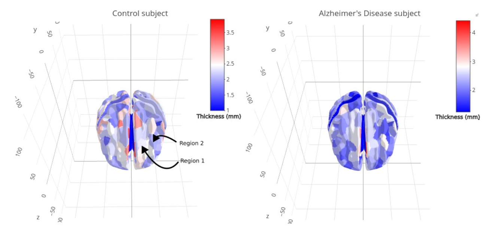

# BIOST_546_Final_Project-
Sophie Whikehart's Final Project for BIOST 546 A Wi 25: Machine Learning for Biomedical And Public Health Big Data 

# Final Project 

## Dataset description and Aims: 

The goal of this project is to apply machine learning techniques to distinguish patients with Alzheimer's Disease (AD) from healthy elderly individuals (C) by analyzing cerebral cortex thickness measurements. Specifically, the dataset consists of cerebral cortex thickness measurements at 360 brain regions of interest along with labels indicating whether each subject has Alzheimer's Disease or is a healthy control.

More about data collection and preprocessing in this [paper](https://www.pnas.org/doi/epdf/10.1073/pnas.200033797) [this is technical and not required for final report].

Mathematically, let $(yi,xi)$, with $i = 1,...,n = 339$, denote the $ith$ observation in the dataset. Here, $xi$, is a vector of length 360 containing the 360 cortical thickness measurements for the $ith$ subject. We can think of these measurements as 360 `variables` (given that the 360 regions where these measurements are taken in are correspondence across subjects). The variable $yi \in$*{C,AD}* is a categorical outcome: Control vs Alzheimer's Disease.

**Dataset** located [here](./datasets/)

The dataset is stored in the file includes the following R objects:

AD_360_training.csv: A CSV file (with header) where the $ith$ row consists of the outcome and the 360 cortical thickness measurements of the $ith$ subject in the **training set**;
AD_360_test_predictors.csv: A CSV file (with header) where the $ith$ row consists of the 360 cortical thickness measurements of the $ith$ subject in the **test set**; the outcomes for the 145 subjects in the test set are not provided. 

## Accuracy on a blinded test set 

For the 145 observations in the test set, you will need to compute the **predicted probabilities of AD** and submit them to Canvas three times during the course. We will use your predicted probabilities and the true labels to calculate AUC of your current model. Before submitting, save your predictions in a text file with 145 rows, **where the j-th row contains a number between 0 and 1, representing the predicted probability for the j-th subject in the test set**. This text file is the only file you may submit. Additionally, include a one- or two-sentence comment in your Canvas submission describing the model used to generate your predictions. 

**Note**: Your prediction accuracy score won't negatively impact your final project grade. This is intended to reproduce a realistic scenario. However, top-scoring models may receive extra credits and we may ask some of those students to briefly present their models to the class 

## Report 

You have to submit a final report via Canvas by March 16. This report should describe your statistical analysis. The maximum length of the report is 5 pages (A4 format, single-spaced, figures and tables included), with top and bottom margins of 1 inch and side margins of 1 1/4 inches. The minimum font size allowed is 11pt. 

## Recommended Report structure 
  - Short abstract
  - Very brief introduction
  - Data analysis
  - Results and conclusions 

